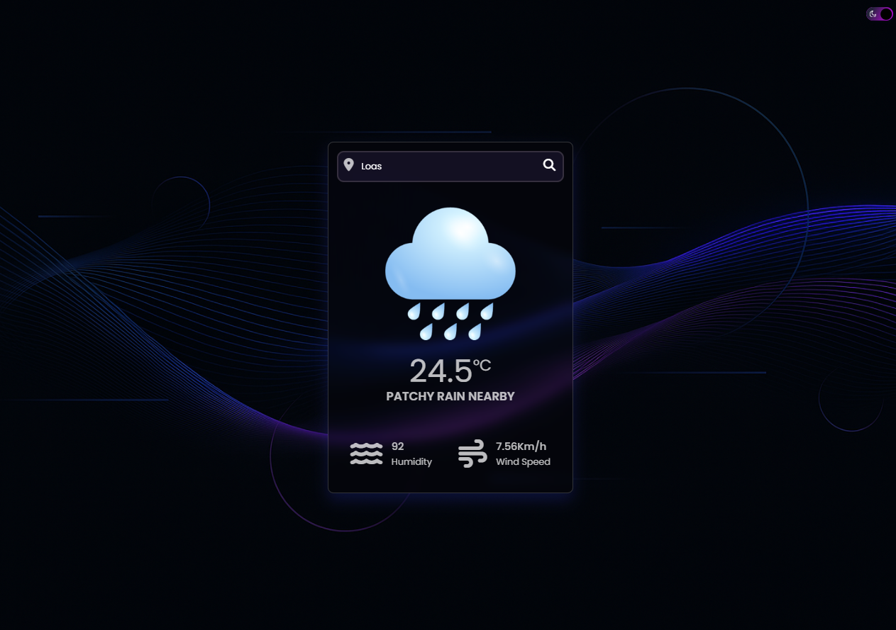
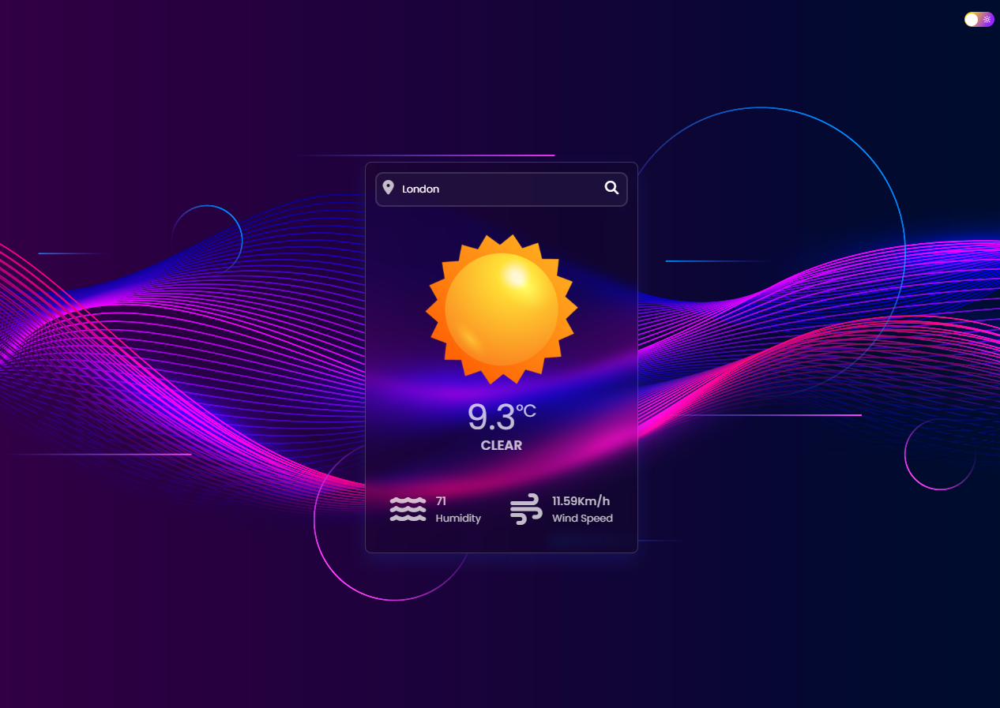

# Weather App

A sleek and interactive weather application that fetches real-time weather data using an API. The app provides current temperature, humidity, and wind speed for any searched location.

## Features

- Search for weather conditions in any city.
- Displays temperature, weather condition, humidity, and wind speed.
- Beautiful and modern UI with dark/light theme support.

## Technologies Used

- **HTML**: Structure of the web page.
- **CSS**: Styling for the user interface.
- **JavaScript**: Handles API interactions and dynamic UI updates.

## Usage

1. Open the application in a web browser.
2. Enter a city name in the search bar and click on the search button.
3. View real-time weather details including temperature, humidity, and wind speed.

## Screenshots

## Author

Developed by Mohamed.

---
